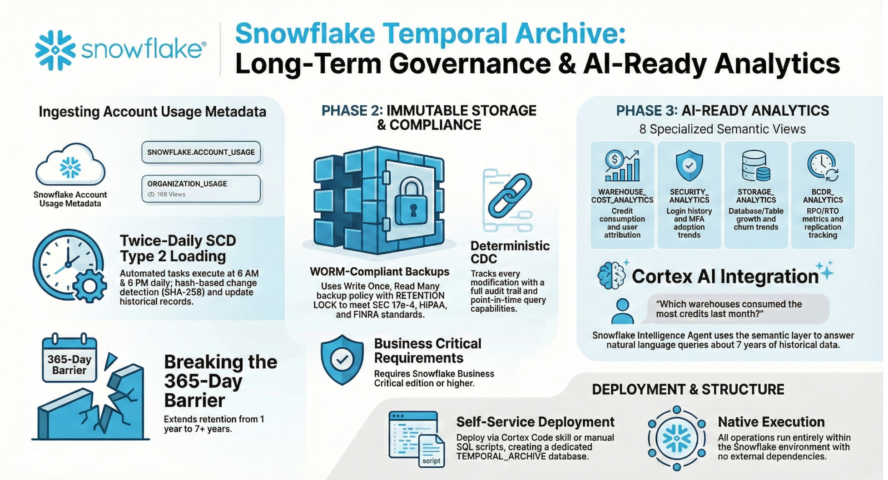

**Preserve your Snowflake ACCOUNT_USAGE history beyond the native 365-day limit with SCD Type 2 archiving and WORM-compliant backups.**

## What This Does

| Feature | Description |
|---------|-------------|
| **Extended Retention** | Archive 113 ACCOUNT_USAGE views (84 active) with 7+ year history (vs 1 year native) |
| **SCD Type 2 History** | Track every change with full audit trail and point-in-time queries |
| **WORM Compliance** | Immutable backups with RETENTION LOCK for SEC 17a-4, HIPAA, FINRA |
| **AI-Ready Analytics** | 9 semantic views + Cortex Intelligence Agent for natural language queries |
| **Self-Service Deployment** | Cortex Code skill for parameterized deployment to any account |

## Quick Start

### Option 1: Hands-On Quickstart (20-30 minutes)

**[Quickstart Guide](docs/quickstart.md)** - Step-by-step tutorial to deploy Temporal Archive from scratch.

### Option 2: Cortex Code Skill (Recommended for existing users)

```
Deploy Temporal Archive to my account
```

Or with custom settings:
```
Deploy Temporal Archive with database MY_ARCHIVE and warehouse MY_WH
```

### Option 3: Manual SQL Deployment

```sql
-- Run as ACCOUNTADMIN
\i sql/01_initial_setup.sql

-- Run as DATA_ADMIN  
\i sql/02_scd_load.sql
\i sql/03_semantic_layer.sql
\i sql/04_streamlit_ddl.sql

-- Initial data load
CALL TEMPORAL_ARCHIVE.ARCHIVE.RUN_SCD_LOAD();
```

## Architecture

```
SNOWFLAKE.ACCOUNT_USAGE (113 views registered, 84 active)
         │
         │ 3-Strategy Delta Load (6 AM & 6 PM daily)
         │  ├── APPEND_ONLY: Watermark-based delta (38 views)
         │  ├── SOFT_DELETE_MUTABLE: Full SCD2 w/ temp table (33 views)
         │  └── FULL_COMPARE: Hash comparison fallback (13 views)
         ▼
┌─────────────────────────────────────────────────────────┐
│  TEMPORAL_ARCHIVE Database                              │
│  ├── ACCOUNT_USAGE Schema (SCD Type 2 archive tables)   │
│  ├── SEMANTIC Schema (9 semantic views)                 │
│  ├── AGENTS Schema (SNOWFLAKE_INTELLIGENCE agent)       │
│  └── ARCHIVE Schema (procedures, tasks, registry, log)  │
│       ├── VIEW_REGISTRY (113 views, 84 active)          │
│       ├── WATERMARK_STATE (delta load tracking)         │
│       └── LOAD_LOG (execution history)                  │
│                                                         │
│  + WORM Backup Policy (7-year retention, immutable)     │
└─────────────────────────────────────────────────────────┘
```

## What Gets Deployed

| Component | Count | Description |
|-----------|-------|-------------|
| Archive Tables | 84 active | SCD Type 2 tables (29 deactivated org/reader/data-sharing views) |
| Semantic Views | 9 | Cost, security, storage, governance, tasks, BC/DR, query performance analytics |
| Cortex Agent | 1 | SNOWFLAKE_INTELLIGENCE with 8 tools for natural language queries |
| Scheduled Tasks | 2 | Morning (6 AM) and evening (6 PM) SCD loads |
| Backup Policy | 1 | WORM-compliant with 7-year retention |

## Semantic Views

| View | Use Cases |
|------|-----------|
| `WAREHOUSE_COST_ANALYTICS` | Warehouse credits, query costs, user attribution |
| `SERVERLESS_COST_ANALYTICS` | Dynamic tables, tasks, pipes, auto-clustering costs |
| `COST_ANALYTICS` | General cost overview and trends |
| `SECURITY_ANALYTICS` | Login history, failed attempts, MFA adoption |
| `STORAGE_ANALYTICS` | Database/table storage, growth trends |
| `GOVERNANCE_ANALYTICS` | Users, roles, grants, access control |
| `TASK_ANALYTICS` | Task execution, failures, scheduling |
| `BCDR_ANALYTICS` | RPO/RTO metrics, hot tables, replication |
| `QUERY_PERFORMANCE_ANALYTICS` | Long-running queries, table access patterns, spill/queue alerts |

## Sample Agent Questions

```
"Which warehouses consumed the most credits last month?"
"Show failed login attempts this week"
"What are my hot tables with highest data churn?"
"Who are the top credit consumers by role?"
"What's my storage growth trend?"
"Show me long-running queries over 5 minutes"
"Which users accessed the CUSTOMERS table last week?"
"What queries have high partition scan percentages?"
```

## Repository Structure

```
├── sql/                        # Deployment SQL scripts
│   ├── 01_initial_setup.sql    # Database, warehouse, roles, backup policy
│   ├── 02_scd_load.sql         # SCD procedures and scheduled tasks
│   ├── 03_semantic_layer.sql   # 9 semantic views for Cortex Analyst
│   ├── 04_streamlit_ddl.sql    # Streamlit support objects
│   └── 05_streamlit_app.sql    # Streamlit app deployment
├── skill/                      # Cortex Code skill for self-service deployment
│   ├── SKILL.md                # Skill entry point
│   ├── config.template.yaml    # Configuration parameters
│   ├── templates/              # Parameterized SQL templates
│   └── scripts/                # Deployment automation
├── agent/                      # Cortex Agent configuration
├── src/                        # Streamlit application
└── docs/                       # Extended documentation
    ├── quickstart.md           # 20-30 min hands-on deployment guide
    ├── queries.md              # Sample analytical queries
    ├── skill-deployment.md     # Skill deployment guide
    ├── architecture.md         # Technical architecture details
    └── scd-design.md           # SCD Type 2 implementation details
```

## Documentation

| Document | Description |
|----------|-------------|
| **[Quickstart Guide](docs/quickstart.md)** | 20-30 minute hands-on tutorial for first-time deployment |
| [Sample Queries](docs/queries.md) | Ready-to-use SQL queries for cost, security, compliance |
| [Skill Deployment](docs/skill-deployment.md) | How to deploy using Cortex Code skill |
| [Architecture](docs/architecture.md) | Technical design and data flow |
| [SCD Design](docs/scd-design.md) | SCD Type 2 implementation details |

## Requirements

- **Snowflake Edition**: Business Critical or higher (for RETENTION LOCK)
- **Role**: ACCOUNTADMIN for initial setup
- **Features**: Cortex Analyst and Cortex Agents enabled

## Key Design Principles

1. **Native Execution** - All operations run within Snowflake (Tasks + Backup Policy)
2. **Immutability First** - WORM backup policy ensures audit compliance
3. **3-Strategy Delta Loading** - APPEND_ONLY (watermark), SOFT_DELETE_MUTABLE (temp table SCD2), FULL_COMPARE (hash fallback)
4. **Hash-Based CDC** - Deterministic change detection via `SHA2(TO_JSON(OBJECT_CONSTRUCT(*)), 256)`
5. **AI-Ready** - Semantic views optimized for Cortex Analyst
6. **Self-Service** - Parameterized skill for easy deployment

## Performance

| Metric | Baseline | Optimized | Improvement |
|--------|----------|-----------|-------------|
| Runtime | 2302s (38 min) | 801s (13 min) | **65% faster** |
| Views Processed | 113 (all) | 84 (active) | 29 deactivated |
| Strategy | Full compare only | 3-strategy delta | Watermark + temp table |
| Warehouse | LARGE Standard Gen2 | LARGE Standard Gen2 | Auto-suspend 60s |

## References

- [Snowflake Backups](https://docs.snowflake.com/en/user-guide/backups)
- [Backup Policy](https://docs.snowflake.com/en/sql-reference/sql/create-backup-policy)
- [Semantic Views](https://docs.snowflake.com/en/sql-reference/sql/create-semantic-view)
- [Cortex Agents](https://docs.snowflake.com/en/user-guide/snowflake-cortex/cortex-agents)
